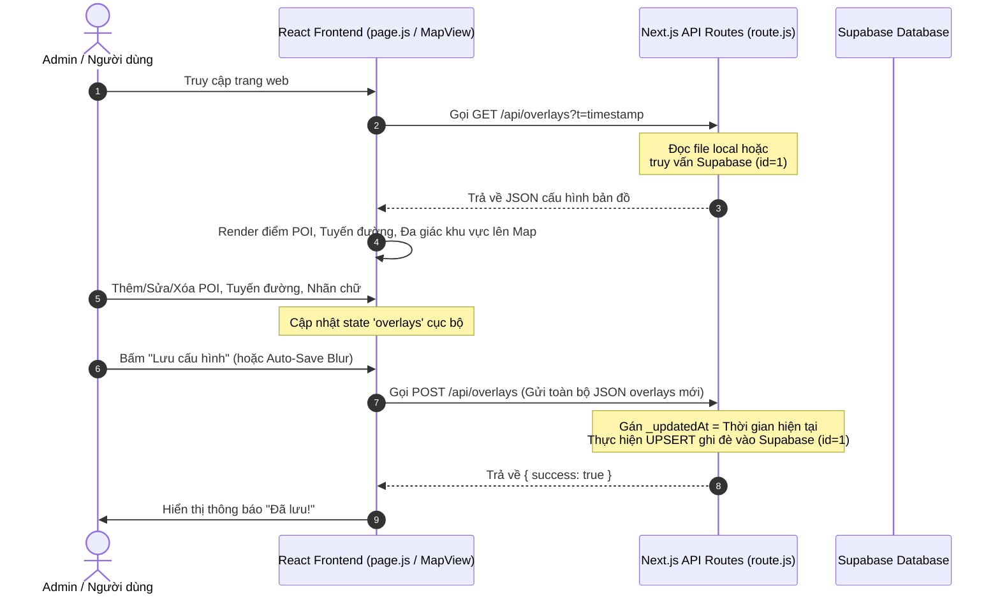

# TÀI LIỆU KIẾN TRÚC & LOGIC VẬN HÀNH DỰ ÁN HONGHAC CITY MAP

Tài liệu này ghi chép chi tiết toàn bộ cấu trúc mã nguồn, logic vận hành của từng hàm, sự tương tác giữa các thành phần giao diện, API Route và Cơ sở dữ liệu Supabase để phục vụ cho việc đọc hiểu và bảo trì dự án lâu dài.

---

## 1. Sơ đồ Luồng Vận hành Tổng thể

Dưới đây là sơ đồ luồng dữ liệu khi tải bản đồ, chỉnh sửa và lưu trữ:

---

## 2. Chi tiết các API Routes (`app/api`)

### 2.1. Quản lý cấu hình Bản đồ (`app/api/overlays/route.js`)

Đây là trung tâm xử lý dữ liệu bản đồ, hỗ trợ chạy cả ở môi trường Local (không Database) và môi trường Vercel (kết nối Supabase).

*   **`isSupabaseConfigured()`**:
    - **Logic**: Kiểm tra xem hai biến môi trường `SUPABASE_URL` và `SUPABASE_ANON_KEY` có tồn tại hay không. Trả về `true` nếu đã cấu hình, `false` nếu chưa.
*   **`GET(request)`**:
    - **Logic hoạt động**:
        1. Đọc tệp tin overlays đi kèm trong gói mã nguồn deploy (`public/data/overlays.json`, nếu không có thì đọc `initial-overlays.json`). Đây gọi là `bundledData`.
        2. Nếu đã cấu hình Supabase:
            - Gửi request đến Supabase lấy bản ghi có `id = 1` trong bảng `map_settings`.
            - **Tự động đồng bộ khi deploy (Auto-Sync)**: So sánh mốc thời gian `_updatedAt` (hoặc `_convertedAt`) của `bundledData` ở local với dữ liệu đang lưu trên Supabase. Nếu dữ liệu local mới hơn (do bạn vừa deploy code mới đã chỉnh sửa ở local lên), API sẽ tự động ghi đè dữ liệu local này lên Supabase trực tuyến để cập nhật bản đồ.
            - **Khởi tạo dữ liệu (Auto-Migration)**: Nếu Supabase trống rỗng (chưa có dòng `id = 1`), API sẽ tự động lấy dữ liệu local ghi đè lên để khởi tạo dữ liệu ban đầu.
        3. Nếu không cấu hình Supabase (chạy local): Đọc trực tiếp nội dung file tĩnh `public/data/overlays.json` trả về cho trình duyệt.
        4. Trả về dữ liệu kèm theo các Header HTTP ngăn chặn lưu bộ nhớ đệm: `Cache-Control: no-store, no-cache...` để đảm bảo trình duyệt luôn hiển thị thông tin mới nhất khi reload.
*   **`POST(request)`**:
    - **Logic hoạt động**:
        1. Nhận chuỗi JSON cấu hình mới từ trình duyệt gửi lên.
        2. Tự động gán nhãn thời gian cập nhật: `data._updatedAt = new Date().toISOString()`.
        3. Nếu đã cấu hình Supabase: Gửi một yêu cầu POST kèm header `Prefer: resolution=merge-duplicates` (đây là cú pháp ghi đè / UPSERT chuẩn của PostgREST) lên bảng `map_settings` của Supabase để ghi đè dữ liệu mới vào dòng `id = 1`.
        4. Nếu chạy local: Ghi đè trực tiếp dữ liệu mới dạng định dạng JSON vào tệp tin tĩnh `public/data/overlays.json` trên ổ đĩa.

---

### 2.2. Quản lý Icon điểm POI (`app/api/icons/route.js`)

Quản lý các tệp ảnh icon (SVG, PNG...) dùng làm biểu tượng cho các điểm ghim POI trên bản đồ.

*   **`GET()`**:
    - **Logic**: Đọc thư mục gốc `/icon`. Tìm kiếm tất cả tệp ảnh hợp lệ. Đồng thời đảm bảo thư mục công khai `/public/icons` luôn tồn tại và tự động sao chép (`copyFile`) toàn bộ các icon này sang thư mục `/public/icons` để trình duyệt có thể truy cập qua URL `/icons/tên_file`.
*   **`POST(request)`**:
    - **Logic**:
        - Nếu gửi file thực tế dạng Form (`multipart/form-data`): Nhận file, làm sạch tên file (xóa ký tự đặc biệt), lưu file vào cả thư mục nguồn `/icon` và thư mục công khai `/public/icons`, sau đó trả về URL truy cập `/icons/tên_file`.
        - Nếu gửi JSON chứa tên file: Copy tệp tương ứng từ `/icon` sang `/public/icons`.
*   **`DELETE(request)`**:
    - **Logic**: Nhận tên file cần xóa. Tuyệt đối **không cho phép xóa** file mặc định (`bridge.svg`). Thực hiện xóa file khỏi cả 2 thư mục `/icon` và `/public/icons` bằng hàm `unlink()`.

---

### 2.3. Quản lý Ảnh Bộ sưu tập của POI (`app/api/images/route.js`)

Quản lý ảnh chụp thực tế hoặc phối cảnh đính kèm trong hộp thông tin (Gallery) của từng điểm POI.

*   **`GET()`**: Đọc danh sách các tệp tin hình ảnh có trong thư mục `/image`.
*   **`POST(request)`**: Nhận tên file ảnh và thực hiện sao chép file đó từ thư mục `/image` sang `/public/images` để phục vụ hiển thị trực tuyến.

---

### 2.4. Xác thực Quyền Admin (`app/api/auth/route.js`)

*   **`POST(request)`**:
    - **Logic**: Nhận thông tin đăng nhập từ client. Đối chiếu thông tin tài khoản cố định:
      - Tài khoản: `admin`
      - Mật khẩu: `123admin@123`
    - Nếu khớp, trả về cookie hoặc cờ xác thực thành công cho client kích hoạt chế độ chỉnh sửa.

---

## 3. Logic Quản lý Trạng thái phía Giao diện (`app/page.js`)

Tệp `app/page.js` quản lý toàn bộ vòng đời trạng thái của ứng dụng bản đồ.

*   **Các State quan trọng**:
    - `overlays`: Lưu trữ toàn bộ điểm POI, các tuyến đường, nhãn chữ hiển thị.
    - `mode`: Chế độ hiển thị (`"view"` - chỉ xem, `"settings"` - chỉnh sửa cấu hình).
    - `searchQuery`: Từ khóa tìm kiếm POI hoặc tuyến đường.
    - `activeRouteEdit`: Lưu thông tin tuyến đường đang được vẽ hoặc chỉnh sửa dở dang.
*   **`loadData()`**:
    - **Logic**: Sử dụng `Promise.all` để tải đồng thời file bản đồ nền địa lý `map-cache.geojson` và dữ liệu cấu hình `/api/overlays`. Có truyền thêm tham số timestamp `?t=timestamp` để chống cache trình duyệt.
*   **`handleSaveOverlays(updatedOverlays)`**:
    - **Logic**: Nhận dữ liệu trạng thái mới nhất từ các Panel chỉnh sửa, gửi yêu cầu `POST /api/overlays` để cập nhật lưu trữ (lên Supabase hoặc local). Hiển thị thông báo "Đã lưu!" hoặc "Lỗi lưu dữ liệu" tương ứng.

---

## 4. Thành phần Bản đồ trực quan (`components/MapView.jsx`)

Sử dụng thư viện `react-leaflet` để vẽ các đối tượng lên bản đồ thực tế.

*   **Hiển thị POI (Điểm ghim)**:
    - Renders các Marker bằng Icon động. Màu sắc của vòng ghim hình giọt lệ ngược được tạo động qua thuộc tính `color` của POI. Kích thước icon được thay đổi động dựa trên thuộc tính `iconSize` thông qua thanh trượt tùy chỉnh.
*   **Hiển thị Tuyến đường (Polylines)**:
    - Lặp qua danh sách các tuyến đường. Nếu một tuyến đường có cấu hình kiểu riêng từng đoạn (`editPerSegment = true`), bản đồ sẽ vẽ từng đoạn nhỏ (segment) với màu sắc, độ rộng (`weight`), và kiểu nét đứt (`isDashed`) riêng biệt đã lưu.
    - **Hiển thị nhãn chữ chạy dọc tuyến đường**: Sử dụng thư viện nhãn chữ chạy dọc theo đường line để hiển thị tên đường trực quan.
*   **Vẽ đa giác (Polygon)**: Hỗ trợ vẽ và khoanh vùng các khu vực hiển thị đặc biệt trên bản đồ.

---

## 5. Bảng điều khiển Chỉnh sửa Cấu hình (`components/SettingsPanel.jsx`)

Đây là nơi Admin thực hiện các chỉnh sửa, chứa nhiều Form biên tập con:

### 5.1. Biên tập điểm POI (`PoiLabelEditor`)
- **Auto-Save Blur**: Khi Admin nhập tên, địa chỉ, hoặc thay đổi thanh trượt kích thước icon, sự kiện `onBlur` hoặc thay đổi slider sẽ gọi hàm `handleSaveField(field, value)` để lưu trực tiếp thay đổi vào state tổng mà không cần bấm nút Lưu thủ công, hạn chế tối đa rủi ro mất dữ liệu khi quên lưu.

### 5.2. Biên tập Tuyến đường (`RoutingEditor`)
- Quản lý thêm mới tuyến đường, chỉnh sửa tọa độ các nút giao.
- Chứa tùy chọn `"Cài đặt kiểu riêng từng đoạn"`: Khi bật, giao diện sẽ hiển thị danh sách các phân đoạn của tuyến đường, cho phép tùy chỉnh màu sắc, độ đậm, kiểu nét đứt, nhãn tên cho từng đoạn cụ thể.

---

## 6. Script Convert KML độc lập (`scripts/convert-kml.mjs`)

Đây là một đoạn mã tiện ích chạy bằng Node.js ở máy tính của bạn (không chạy trực tuyến trên web).

*   **Logic hoạt động**:
    1. Đọc tệp tin định dạng KML chứa thông tin thiết kế địa lý của kiến trúc sư.
    2. Phân tích cú pháp XML, bóc tách các LineString (tuyến đường), Point (điểm tọa độ), Polygon (vùng đất).
    3. Định dạng lại toàn bộ dữ liệu này thành cấu trúc JSON chuẩn của dự án.
    4. Ghi đè vào tệp `app/api/overlays/initial-overlays.json` và cập nhật mốc thời gian chuyển đổi `_convertedAt = new Date().toISOString()`.
    5. Khi bạn chạy deploy mã nguồn mới này, hàm `GET` của API overlays trên Vercel sẽ phát hiện ra sự thay đổi này và tự động đồng bộ đè dữ liệu KML mới này lên Supabase của bạn.

---

## 7. Quản lý Mật khẩu & Cấu hình Bảo mật (Database & Credentials)

Để đảm bảo an toàn và bảo mật cho ứng dụng khi chạy trên internet, các thông số bí mật được quản lý thông qua hai nhóm:

### 7.1. Cấu hình Tài khoản Admin
- **Cách thức hoạt động**: Khi bạn bấm vào biểu tượng cài đặt trên bản đồ, một hộp thoại yêu cầu nhập tài khoản/mật khẩu Admin sẽ hiển thị.
- **Tài khoản mặc định**: 
  - **Username**: `admin`
  - **Password**: `123admin@123`
- **Cách thay đổi an toàn**:
  Mã nguồn đã được cải tiến để ưu tiên đọc thông tin đăng nhập từ biến môi trường (Environment Variables). Bạn có thể cấu hình 2 biến sau trên Vercel hoặc file `.env.local` mà không cần sửa code:
  - **`ADMIN_USERNAME`**: Tên đăng nhập Admin tùy chỉnh mới.
  - **`ADMIN_PASSWORD`**: Mật khẩu Admin tùy chỉnh mới.
  - *Nếu không cấu hình 2 biến này, hệ thống tự động sử dụng tài khoản mặc định ở trên làm dự phòng.*

### 7.2. Cấu hình Kết nối Cơ sở dữ liệu (Database Connection)
Toàn bộ thông tin kết nối tới Database được lưu trữ an toàn dưới dạng các biến môi trường trên Vercel. Không bao giờ được lưu các thông tin này trong mã nguồn đẩy lên GitHub.

*   **Biến môi trường bắt buộc (Supabase)**:
    - **`SUPABASE_URL`**: Địa chỉ API kết nối đến dự án Supabase của bạn. 
      - *Định dạng chuẩn*: `https://[project-reference-id].supabase.co`
    - **`SUPABASE_ANON_KEY`**: Mã khóa công khai (anonymous key) dùng để xác thực các yêu cầu đọc ghi dữ liệu bản đồ.
*   **Biến môi trường cũ (Vercel Blob - Lưu trữ dự phòng)**:
    - **`BLOB_READ_WRITE_TOKEN`**: Token cấp quyền đọc/ghi vào Vercel Blob store.
    - **`BLOB_STORE_URL`**: Đường dẫn tĩnh của tệp tin lưu trữ (được cấu hình để tối ưu hóa giảm số lượng yêu cầu gọi API Vercel).
    - *Các biến Vercel Blob này hiện đã được thay thế bằng Supabase để tránh các giới hạn nghiêm ngặt về số lượng request hàng tháng.*
